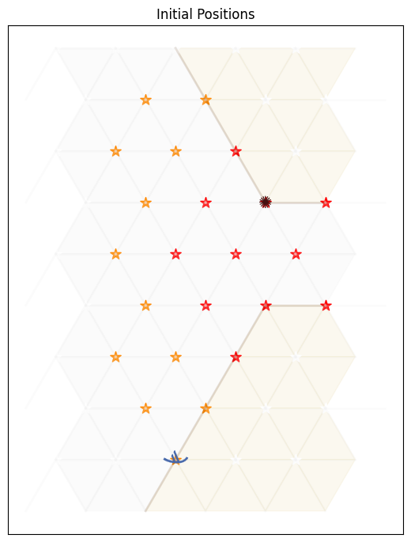
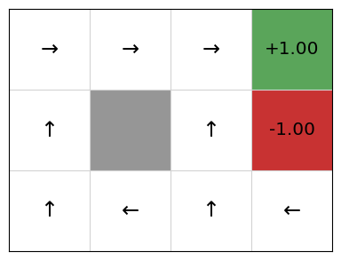
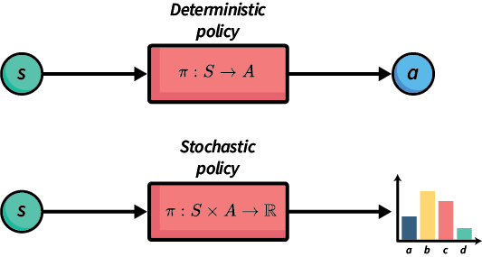

# Markov Decision Processes

The learning outcomes of this chapter are:
1. Define **Markov Decision Process**. 
2. Identify situations in which Markov Decisions Processes (MDPs) are a suitable model of a problem.
3. Compare MDPs to models of search, such as classical planning and heuristic search.
4. Explain how Bellman equations are solutions to MDP problems.

## Overview

A **Markov Decision Process** (MDPs) is a framework for describing sequential decision making problems. In machine learning, problems such as classification and regression are one-time tasks. That is, a classification/regression model is given an input and returns an output. Then, the next input it is given it entirely independent from the first. In sequential decision making problems, we need to make a series of decisions over time, in which each decision influences the possible future. For example, navigating from one place to another requires us to choose a direction and velocity, move in that direction at the velocity, and then make this decision again and again until we reach our destination. So, even at that first step, we have to consider how each move affects the future. As another example, a clinician making medical treatment decisions has to consider whether decisions taken today will impact future decisions about their patients.

In the language of reinforcement learning, we say that the decision maker is the **agent**, and their decisions are **actions** that they execute in an **environment** or **state**.


Techniques like heuristic search and classical planning algorithms assume that action are **deterministic** -- that is, before  an agent executes an action in a state, it knows that the outcome of the action will be. MDPs  remove the assumption of deterministic events and instead assume that each action could have multiple outcomes, with each outcome associated with a probability. If there is only one outcome for each action (with probability 1), then the problem is deterministic. Otherwise, it is **non-deterministic**. MDPs consider **stochastic** non-determinism; that is, where there is a probability distribution over outcomes.

Here are some examples of stochastic actions:

-   Flipping a coin has two outcomes: heads ($\frac{1}{2}$) and tails ($\frac{1}{2}$).
-   Rolling two dices together has twelve outcomes: 2 ($\frac{1}{36}$), 3 ($\frac{1}{18}$), 4 ($\frac{3}{36}$), ..., 12 ($\frac{1}{36}$).
-   When trying to pick up an object with a robot arm, there could be two outcomes: successful ($\frac{4}{5}$) and unsuccessful  ($\frac{1}{5}$).
-   When we connect to a web server, there is a 1% chance that the document we are requesting will not exist (404 error) and 99% it will exist.
-   When we send a patient for a test, there is a 20% the test will come back negative, and an 80% chance it will come back positive.

MDPs have been successfully applied to planning in many domains: robot navigation, planning which areas of a mine to dig for minerals, treatment for patients, maintenance scheduling on vehicles, and many others.

## Markov Decision Processes

Definition -- Markov Decision Process

A **Markov Decision Process** (MDP) is a  **fully observable**, **probabilistic** state model. The most common formulation of MDPs is a **Discounted-Reward Markov Decision
Process**. A discount-reward MDP  is a tuple $(S, s_0, A, P, r, \gamma)$ containing:

-   a state space $S$;
-   initial state $s_0 \in S$;
-   actions $A(s) \subseteq A$ applicable in each state $s \in S$ that our agent can execute;
-   **transition probabilities** $P_a(s' \mid s)$ for $s \in S$ and
    $a \in A(s)$;
-   **rewards** $r(s,a,s')$ positive or negative of transitioning from
    state $s$ to state $s'$ using action $a$; and
-   a **discount factor** $0 \leq \gamma < 1$.

Let's break down the above points in model detail.

**States** are the possible situations in which the agent can be in. Each state captures the information required to make a decision. For example, in robot navigation, the state consists of the position of the robot, the current velocity of the robot, the direction it is heading, and  the position of obstacles, doors, etc. In an application for scheduling maintenance on vehicles for a delivery company, the state would consist of vehicle IDs, vehicle properties such as make, maximum load, etc., location of vehicles, number of kilometres since their last maintenance check, etc.

The **state space** is simple the set of all possible states. That is, the combination of all vehicle IDs, vehicle properties, maximum loads, etc.

**Actions** allow agents to affect the environment/state --- that is, actions transition the environment from one state to another. They are also the choices that are available to an agent in each state: *which action should I choose now?* For now, we assume that the agent is the only entity that can affect a state. 

As noted above, an action can have multiple possible outcomes. Exactly one outcome will occur, but the agent does not know which one until after the action is executed.

**Transition probabilities** tell us the effect(s) of each action, including the probabilities of each outcome. For example, in the vehicle maintenance task, when our agent schedules a vehicle to be inspected, possible outcomes could be: (a) no further maintenance required (80% chance); (b) minor maintenance required (15% chance); or (c) major maintenance required (5% chance).

**Rewards** specifies the benefit or cost of executing a particular action in a particular state. For example, a robot navigating to its destination receives a positive reward (benefit) for reaching its destination, a small negative reward (cost) for running into objects on the way; and a large negative reward for running into people.

The **discount factor** $\gamma$ (pronounced "gamma") determines how much a future reward should be discounted compared to a current reward.

For example, would you prefer \$100 today or \$100 in a year's time? We (humans) often *discount* the future and place a higher value on nearer-term rewards.

Assume our agent receives rewards $r_1, r_2, r_3, r_4, \ldots$ in that order. If $\gamma$ is the discount factor, then the discounted reward is:

$$
 \begin{array}{lll}
  V & = & r_1 + \gamma r_2 + \gamma^2 r_3 + \gamma^3 r_4 + \ldots\\
    & = & r_1 + \gamma(r_2 + \gamma(r_3 + \gamma(r_4 + \ldots)))
 \end{array}
$$

If $V_t$ is the value received at time-step $t$, then $V_t = r_t + \gamma V_{t+1}$. So, the further away a reward is from the start state $s_0$, the less actual reward we will receive from it.

In an MDP, a discount reward must be strictly less than 1. Later, we will see why this is important.

Example MDP: Grid World

An agent is in the bottom left cell of a grid. The grey cell is a wall. The two coloured cells give a **reward**. There is a reward of 1 of being in the top-right (green) cell, but a negative value of -1 for the cell immediately below (red).

<div align="center">
  
</div>

But! Things can go wrong --- sometimes the effects of the actions are not what we want:

-   If the agent tries to move north, 80$\%$ of the time, this works as planned (provided the wall is not in the way)
-   10$\%$ of the time, trying to move north takes the agent west (provided the wall is not in the way);
-   10$\%$ of the time, trying to move north takes the agent east (provided the wall is not in the way)
-   If the wall is in the way of the cell that would have been taken, the agent stays in the current cell.

The task is to navigate from the start cell in the bottom left to maximise the expected reward. What would the best sequence of actions be for this problem?


Example MDP: Contested Crossing

An agent (a ship), denoted using ; is at the south shore of a body of water. It may sail between points on the hexagonal grid where the terrain is water (pale grey), but not on land (pale yellow), choosing a different direction at each step (West, North-West, North-East, East, South-East or South-West). There is a reward of 10 for reaching the north shore, but a negative value of -10 for sinking on the way.

<div align="center">
  
</div>

At the closest point of the north shore is an enemy, denoted using the ✺ character. The enemy will shoot at the ship when it is in areas of danger (yellow or red stars). It will do so once for each step. Therefore, the enemy's behaviour is completely determined and no choice needs to be made. 

In locations with yellow or red stars, the ship may also shoot at the enemy, but it cannot do so and turn at the same time. If it chooses to shoot, it will continue sailing in the same direction. 


-   In areas of low danger (yellow), a shot will damage the target 10$\%$ of the time (either the ship firing at the enemy, or the enemy firing at the ship).

-   In areas of high danger (red), a shot will damage the target 99$\%$ of the time.

-   When the ship is damaged, it has a chance of failing to move in its step. At full health, the ship moves successfully 100$\%$ of the time, with  damage level 1 it moves successfully 67$\%$ and at  damage level 2, 33$\%$; and at damage level 3 , it sinks.

-   When the enemy is at damage level 1, there is no change in its behaviour. When it is at damage level 2 it is destroyed. At this point the ship is in no further danger.

The ship can observe the the entire state: it's location, the enemy location, it's own health, and the health of the enemy.

In this task, the agent again has the problem of navigating to a place where a reward can be gained, but there is extra complexity in deciding the best plan. There are multiple different high reward end states and low reward end states. There are paths to the reward which are slow, but guarantee achieving the high reward, and there are other paths which are faster, but more risky.

Example MDP model

*Probabilistic PDDL* is one way to represent an MDP. It extends PDDL with a few additional constructs. Of most relevance is that outcomes can be associated with probabilities. The following describes the "Bomb and Toilet" problem, in which one of two packages contains a bomb. The bomb can be diffused by dunking it into a toilet, but there is a 0.05 probability of the bomb clogging the toilet.

```
(define (domain gridworld)

    (:requirements :conditional-effects :probabilistic-effects)

    (:predicates (bomb-in-package ?pkg) (toilet-clogged) (bomb-defused))

    (:action dunk-package
     :parameters (?pkg)
     :effect (and (when (bomb-in-package ?pkg) (bomb-defused))
             (probabilistic 0.05 (toilet-clogged))))
```

MDPs can also be expressed as code, rather than just as a model. An algorithm for solving the MDP creates an instance of a class and obtains the information that it requires to solve it.

Example MDP model as Python code: Grid World

First, we have an interface that defines what an MDP is:

``` python
class MDP:
    """ Return all states of this MDP """
    def get_states(self):
        abstract

    """ Return all actions with non-zero probability from this state """
    def get_actions(self, state):
        abstract

    """ Return all non-zero probability transitions for this action
        from this state, as a list of (state, probability) pairs
    """
    def get_transitions(self, state, action):
        abstract

    """ Return the reward for transitioning from state to
        nextState via action
    """
    def get_reward(self, state, action, next_state):
        abstract

    """ Return true if and only if state is a terminal state of this MDP """
    def is_terminal(self, state):
        abstract

    """ Return the discount factor for this MDP """
    def get_discount_factor(self):
        abstract

    """ Return the initial state of this MDP """
    def get_initial_state(self):
        abstract

    """ Return all goal states of this MDP """
    def get_goal_states(self):
        abstract
```

Then, we need to implement this interface to create an MDP. Below is the implementation for `get_transitions` and `get_reward` for GridWorld:

``` python
class GridWorld(MDP):

    ...

    def get_transitions(self, state, action):
        transitions = []

        if state == self.TERMINAL:
            if action == self.TERMINATE:
                return [(self.TERMINAL, 1.0)]
            else:
                return []

        # Probability of not slipping left or right
        straight = 1 - (2 * self.noise)

        (x, y) = state
        if state in self.get_goal_states().keys():
            if action == self.TERMINATE:
                transitions += [(self.TERMINAL, 1.0)]

        elif action == self.UP:
            transitions += self.valid_add(state, (x, y + 1), straight)
            transitions += self.valid_add(state, (x - 1, y), self.noise)
            transitions += self.valid_add(state, (x + 1, y), self.noise)

        elif action == self.DOWN:
            transitions += self.valid_add(state, (x, y - 1), straight)
            transitions += self.valid_add(state, (x - 1, y), self.noise)
            transitions += self.valid_add(state, (x + 1, y), self.noise)

        elif action == self.RIGHT:
            transitions += self.valid_add(state, (x + 1, y), straight)
            transitions += self.valid_add(state, (x, y - 1), self.noise)
            transitions += self.valid_add(state, (x, y + 1), self.noise)

        elif action == self.LEFT:
            transitions += self.valid_add(state, (x - 1, y), straight)
            transitions += self.valid_add(state, (x, y - 1), self.noise)
            transitions += self.valid_add(state, (x, y + 1), self.noise)

        # Merge any duplicate outcomes
        merged = defaultdict(lambda: 0.0)
        for (state, probability) in transitions:
            merged[state] = merged[state] + probability

        transitions = []
        for outcome in merged.keys():
            transitions += [(outcome, merged[outcome])]

        return transitions

    def valid_add(self, state, new_state, probability):
        # If the next state is blocked, stay in the same state
        if probability == 0.0:
            return []

        if new_state in self.blocked_states:
            return [(state, probability)]

        # Move to the next space if it is not off the grid
        (x, y) = new_state
        if x >= 0 and x < self.width and y >= 0 and y < self.height:
            return [((x, y), probability)]

        # If off the grid, state in the same state
        return [(state, probability)]

    def get_reward(self, state, action, new_state):
        reward = 0.0
        if state in self.get_goal_states().keys() and new_state == self.TERMINAL:
            reward = self.get_goal_states().get(state)
        else:
            reward = self.action_cost
        step = len(self.episode_rewards)
        self.episode_rewards += [reward * (self.discount_factor ** step)]
        return reward
```

Let's break this down into its parts:

- The state space $s$ here is the location of the robot in Cartesian coordinates: $(x,y)$, where $x$ is the column and $y$ the row. The state space is the set of all possible coordinates from $(0,0)$ to $(3,2)$, as well as a special state called $Terminal$ from which we cannot escape and transitioning to it has no reward. We can expand the state space to be larger.

- The initial state $s_0$ is the location $(0,0)$ in the bottom left. 

- The actions are *Up*, *Down*, *Left*, and *Right*, as well as the special action *Terminate*, which transitions into the *Terminal* state from a goal state.

- ``get_transitions`` defines the transition probabilities. For example, we can see that if the action is *Left*, then there are three possible transitions: to the left with 0.8 probability, and either up or down with 0.1 probability each. The method ``valid_add`` ensures that if we agent cannot go in that direction due to a wall, it remains in the current state for its outcome.

- The reward is modelled as receiving +1 or -1 for exiting a goal state and transitioning into the terminal state. We will see later that this models our desire that the goal states have the value of 1 and -1 respectively.

- Finally, the discount factor is simply a parameter to the MDP in this code, with default value 0.9.

In later chapters, we will see how to use these code-based models in several ways, including both model-based and model-free methods.


### MDPs vs deterministic search

You may have studied search algorithms previously, such as classical planning or heuristic search algorithms like A*

What is different between an MDP and search-based solutions? There are four main differences:

-   The transition function is not deterministic. Each action has a probability of $P_a(s' \mid s)$ of ending in state $s'$ if $a$ is executed in the state $s$, whereas in classical planning, the outcome of each action is known in advance.
-   There are no goal states. Each action receives a reward when applied. The value of the reward is dependent on the state in which it is applied.
-   There are no action costs. Actions costs are modelled as negative rewards.
-   We have a discount factor. In classical planning, executing an action typically has a cost. A discount factor of less than 1 implicitly rewards shorter plans, all other things being equal.

## Policies

The planning problem for discounted-reward MDPs is different to that of classical planning or heuristic search because the actions are non-deterministic. Instead of a sequence of actions, an MDP produces a *policy*.

Definition -- Policy

A **policy** $\pi$ is a function that tells an agent which is the best action to choose in each state. A policy can be **deterministic** or **stochastic**.

### Deterministic vs. stochastic policies

A **deterministic policy** $\pi : S \rightarrow A$ is a function that maps states to actions. It specifies which action to choose in every possible state. Thus, if we are in state $s$, our agent should choose the action defined by $\pi(s)$.
A graphical representation of the policy for Grid World is:

<div align="center">
  
</div>

So, in the initial state (bottom left cell), following this policy the agent should go up. If it accidentally slips right, it should go left again to return to the initial state.

Of course, agents do not work with graphical policies. The output from a planning algorithm would be a dictionary-like object or a function that takes a state and returns an action.

A **stochastic policy** $\pi : S \times A \rightarrow \mathbb{R}$ specifies the **probability distribution** from which an agent should select an action. Intuitively, $\pi(s,a)$ specifies the probability that action $a$ should be executed in state $s$.

To execute a stochastic policy, we could just take the action with the maximum $\pi(s,a)$. However, in some domains, it is better to select an action based on the probability distribution; that is, choose the action probabilistically such that actions with higher probability are chosen proportionally to their relative probabilities.

<div align="center">
  
</div>

The above figure shows the difference. The output of a deterministic policy is an action. A deterministic policy will always return the same action in the same state. The output of a stochastic policy is a probability distribution over the set of possible actions. Typically, the output is chosen stochastically from that output. In above figure`, action $b$ would be the most likely to be chosen -- just a bit more likely than action $c$. 

We can use stochastic policies to implement deterministic policies: always choose the most likely action. However, stochastic policies are typically used stochastically during learning, and then deterministically once learning has finished and we deploy our agents.

In the early chapters, we will focus mostly on  deterministic policies, but stochastic policies have their place when we discuss policy gradient methods.

### Representing policies

Policies can be represented in several ways, but all have the same basic interface: the ability to update the policy and the ability to get an action for a state (in a deterministic policy) or get the value or probability of playing an action (in a stochastic policy):

``` py
class Policy:
    def select_action(self, state, action):
        abstract


class DeterministicPolicy(Policy):
    def update(self, state, action):
        abstract


class StochasticPolicy(Policy):
    def update(self, states, actions, rewards):
        abstract

    def get_probability(self, state, action):
        abstract
```

The simplest way to represent a policy is a tabular policy, which keeps a table that maps from each state to the action for that state. We implement this as a dictionary in Python:

``` py
import random
from collections import defaultdict
from policy import DeterministicPolicy


class TabularPolicy(DeterministicPolicy):
    def __init__(self, default_action=None):
        self.policy_table = defaultdict(lambda: default_action)

    def select_action(self, state, actions):
        return self.policy_table[state]

    def update(self, state, action):
        self.policy_table[state] = action
```

As we see later in the section on policy gradients, policies can be represented using other means, such as machine learning models, which do not require us to keep an explicit answer for every state.

## Optimal Solutions for MDPs

For discounted-reward MDPs, optimal solutions maximise the **expected discounted accumulated reward** from the initial state $s_0$. But what is the expected discounted accumulated reward?


Definition -- Expected discounted reward

The **expected discounted reward** from $s$ for a policy $\pi$ is:

$$
V^{\pi}(s) = E_{\pi}[\sum_{i} \gamma^i r(s_i, a_i, s_{i+1}) \mid s_0 = s, a_i = \pi(s_i)]
$$

So, $V^{\pi}(s)$ defines the expected value of following the policy $\pi$ from state $s$.

For our Grid World example, assuming only the -1 and +1 states have rewards, the expected value is:

$$
\begin{array}{lll}
   & \gamma^5 \times 1 \times (0.8^5) & \textrm{(optimal movement)}\\
 + &  \gamma^7 \times 1 \times (0.8^7) & \textrm{(first move only fails)}\\
 + & \ldots                             \textrm{(etc.)}
\end{array}
$$


Definition -- Bellman equation

The **Bellman equation**, identified by Richard Bellman, describes the
condition that must hold for a policy to be optimal. The Bellman equation is defined recursively
as:

$$
V(s) = \max_{a \in A(s)} \sum_{s' \in S} P_a(s' \mid s)\ [r(s,a,s') + \gamma\  V(s')]
$$


Therefore, $V$ is optimal **if** for all states $s$, $V(s)$ describes the total discounted reward for taking the action with the highest reward over an indefinite/infinite horizon.

Let's break this down:

$$
V(s) = \overbrace{\max_{a \in A(s)}}^{\text{best action from $s$}} \overbrace{\underbrace{\sum_{s' \in S}}_{\text{for every state}} P_a(s' \mid s) [\underbrace{r(s,a,s')}_{\text{immediate reward}} + \underbrace{\gamma}_{\text{discount factor}} \cdot  \underbrace{V(s')}_{\text{value of } s'}]}^{\text{expected reward of executing action $a$ in state $s$}}
$$

First, we calculate the expected reward for each action. The reward of an action is: the sum of the immediate reward for all states possibly resulting from that action plus the discounted  future reward of those states. The discounted future reward is the $\gamma$ (discount reward) times the value of $s'$, where $s'$ is the state that we end up in. However, because we can end up in multiple states, we must multiple the reward by the probability of it happening: $P_a(s' \mid s)$.

Second, the value $V(s)$ is the value of the action with the maximum the expected reward. This is because the Bellman equation assumes that once we know the best states, we will always take the action that leads to the best state.

Bellman equations can be described slightly differently, using what are known as *$Q$-values*.

If $V(s)$ is the expected value of being in state $s$ and acting optimally according to our policy, then we can also describe the *Q-value* of being in a state $s$, choosing action $a$ and then acting optimally according to our policy as.

Definition -- Q-value

The **Q-value** for action $a$ in state $s$ is defined as:

$$
Q(s,a) = \sum_{s' \in S} P_a(s' \mid s)\ [r(s,a,s') + \gamma\  V(s') ]
$$

This represents the value of choosing action $a$ in state $s$ and then following this same policy until termination.
:::

This is just the expression inside the $\max$ expression in the Bellman equation. Using this, we can then Bellman equation then defined as: 

$$
V(s) = \max_{a \in A(s)} Q(s,a)
$$

The two definitions are equivalent, and you may seem them defined in both ways. However, when we move onto Q-learning later, we will use $Q$-values more explicitly.


## Policy extraction

Given a value function $V$, how should we then select the action to play in a given state? It is reasonably straightforward: select the action that maximises our expected utility!

So, if the value function $V$ is optimal, we can select the action with the highest expected reward using:

$$\pi(s) = \text{argmax}_{a \in A(s)} \sum_{s' \in S} P_a(s' \mid s)\ [r(s,a,s') + \gamma\  V(s')]$$

This is known as **policy extraction**, because it extracts a policy for a value function (or Q-function). This can be calculated 'on the fly' at run time, or we can extract a policy beforehand and use this.

Alternatively, given a Q-function instead of a value function, we can use:

$\pi(s) = \text{argmax}_{a \in A(s)} Q(s,a)$

This is simpler than using the value functions because we do not need to sum over the set of
possible output states, but we need to store $|A| \times |S|$ values in a Q-function, but just $|S|$ values in a value function.

### Implementation

Policy extraction takes a value function and extracts a tabular policy. In this implementation, we extract a tabular policy using policy extraction from a value function:

```py
from tabular_policy import TabularPolicy

class ValueFunction():

    def update(self, state, value):
        abstract

    def merge(self, value_table):
        abstract

    def get_value(self, state):
        abstract

    """ Return the Q-value of action in state """
    def get_q_value(self, mdp, state, action):
        q_value = 0.0
        for (new_state, probability) in mdp.get_transitions(state, action):
            reward = mdp.get_reward(state, action, new_state)
            q_value += probability * (
                reward
                + (mdp.get_discount_factor() * self.get_value(new_state))
            )

        return q_value

    """ Return a policy from this value function """

    def extract_policy(self, mdp):
        policy = TabularPolicy()
        for state in mdp.get_states():
            max_q = float("-inf")
            for action in mdp.get_actions(state):
                q_value = self.get_q_value(mdp, state, action)

                # If this is the maximum Q-value so far,
                # set the policy for this state
                if q_value > max_q:
                    policy.update(state, action)
                    max_q = q_value

        return policy
```

For each state, we find the best action in the state (the action that maximises the Q-value from that state); and for that state, we set that max action as the action to select in that state.

## Partially Observable MDPs

MDPs assume that the agent always knows exactly what state it is in --- the problem is fully-observable. However, this is not valid for many tasks; e.g. an unmanned aerial vehicle searching in a earthquake zone for survivors will by definition not know the location of survivors; a card-playing agent playing solitaire will not know the cards that are face-down;, etc.

Definition -- Partially-observable MDP

**Partially-observable MDPs** (POMDPs) relax the assumption of
full-observability. A POMDP is defined as:

-   states $s \in S$
-   actions $A(s) \subseteq A$
-   transition probabilities $P_a(s' \mid s)$ for $s \in S$ and $a \in A(s)$
-   initial **belief state** $b_0$
-   reward function $r(s,a,s')$
-   a set of possible observations $Obs$
-   a **sensor model** given by probabilities $O_a(o \mid s)$, $o \in Obs$

The sensor model allows the agent to observe the environment. If an agent executes an action $a$, it has probability $O_a(o \mid s')$ of observing state $s'$.

Solving POMDPs is similar to solving MDPs. In fact, the same algorithms can be applied. The only difference is that we case the POMDP problem as a standard MDP problem with a new state space: each state is a **probability distribution** over the set $S$. Thus, each state of the
POMDP is a **belief state**, which defined the probability of being in each state $S$. This leads to an exponentially-larger state space, so POMDPs are typically harder problems to solve.

Like MDPs, solutions are policies that map belief states into actions. Optimal policies maximise the expected reward.

We will not cover this in detail in these notes. However, POMDPs are  a generalisation of MDPs, and they are more suited to practical solutions in  planning for autonomy than standard MDPs because it is unusual to always know the true state of the world in which an agent  is acting.


## Takeaways
* **Markov Decision Processes** (MDPs) model sequential decision-making problems in which the outcome of an action is stochastic; although the agent can observe the state once the action is executed.

* MDPs can be defined using code, simulators, or models.

* The solution to an MDP is a **policy**.

* A **deterministic policy** is a mapping from states to actions. For policy $\pi$, the term $\pi(s)$ returns the action to execute in state $s$.

* A **stochastic policy** is a mapping from state actions pairs to probabilities. For policy $\pi$, the term $\pi(s,a)$ returns the probability of selecting action $a$ in state $s$.

* An **optimal policy** maximises the expected discounted reward.

* The **Bellman equation** describes the condition that must hold for a policy to be optimal.