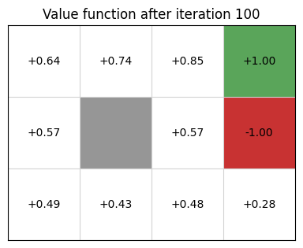
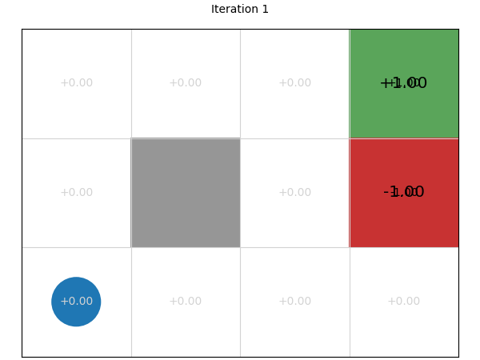
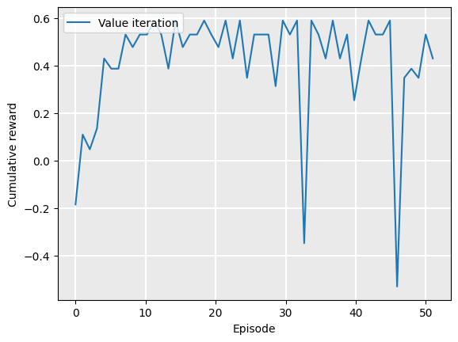
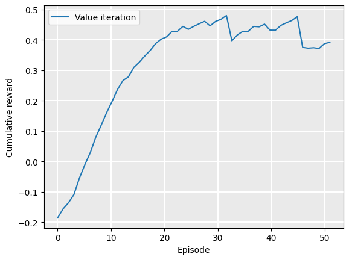
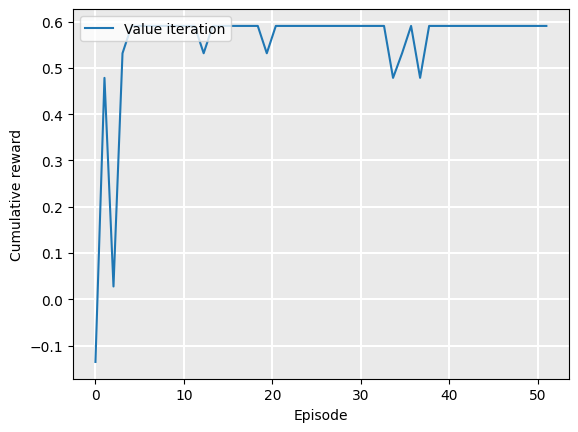
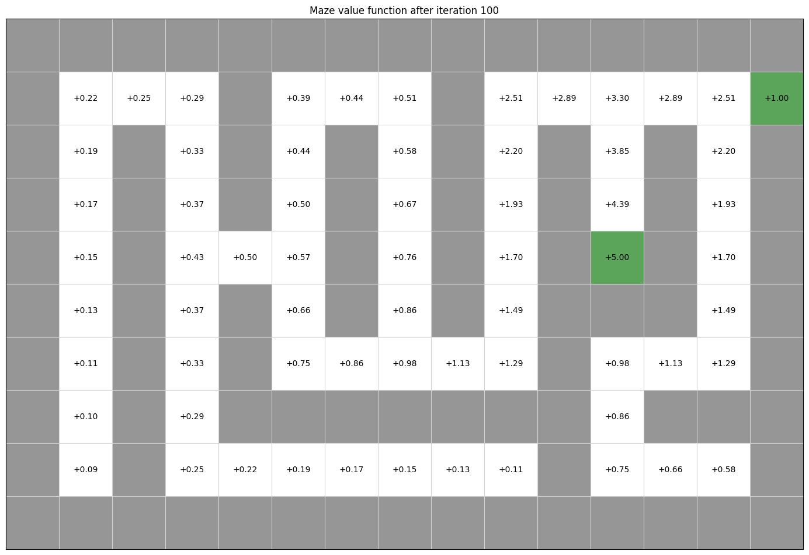
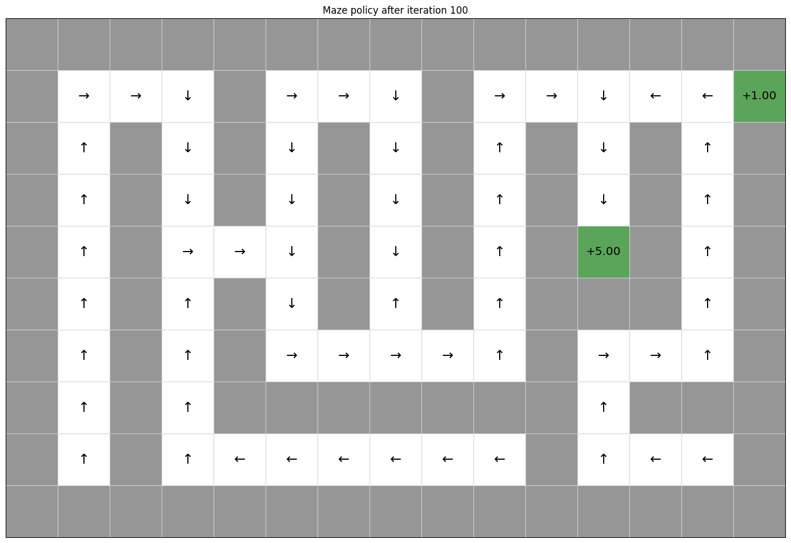
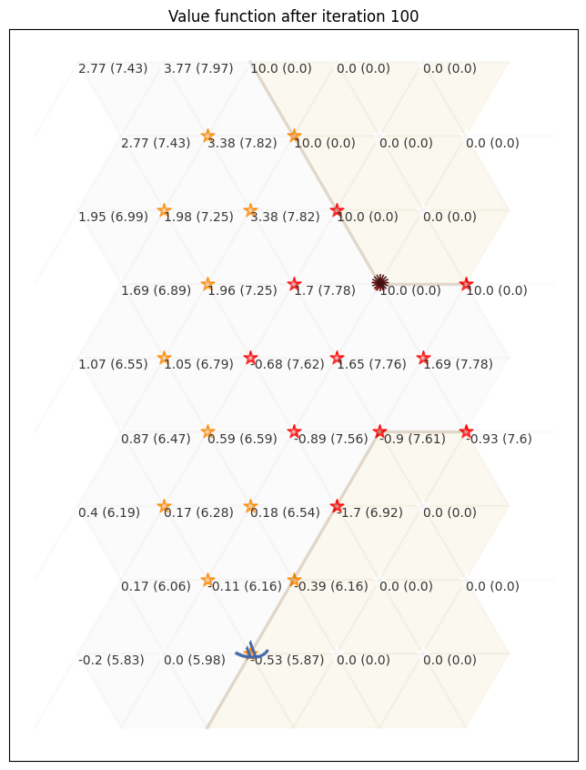
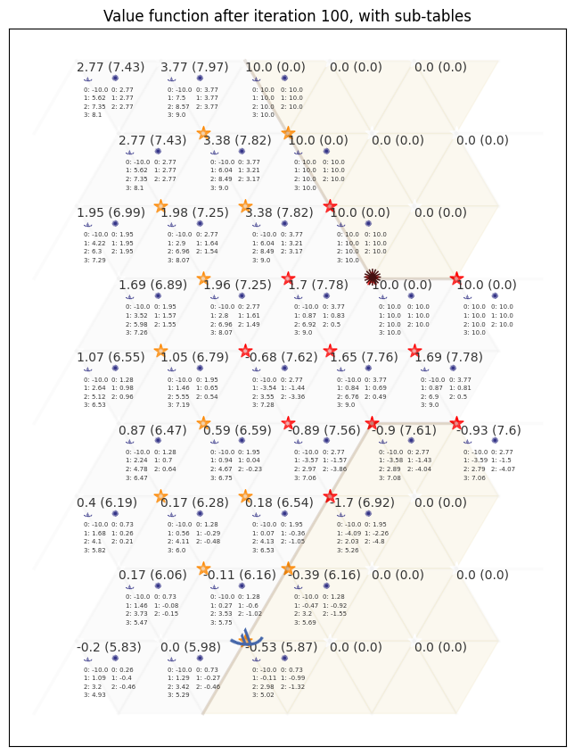
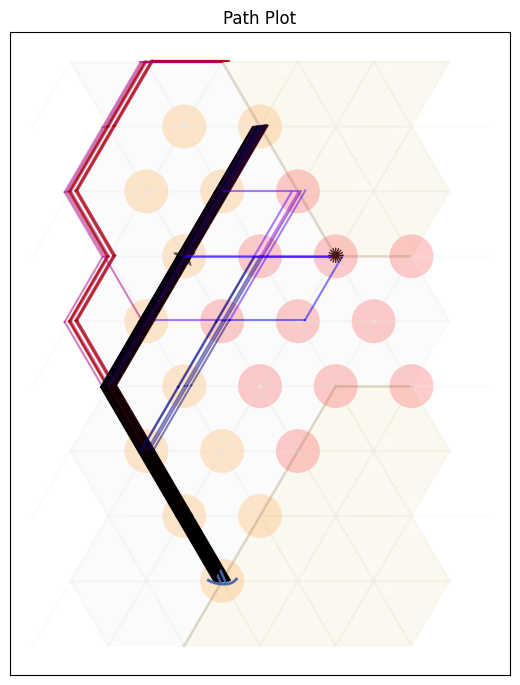

# Value Iteration

The learning outcomes of this chapter are:
1.  Apply value iteration to solve small-scale MDP problems manually and program value iteration algorithms to  solve medium-scale MDP problems automatically.
2.  Construct a policy from a value function.
3.  Discuss the strengths and weaknesses of value iteration.

## Overview

**Value Iteration** is a dynamic-programming method for finding the optimal value function $V^*$ by solving the Bellman equations iteratively. It uses the concept of dynamic programming to maintain  a value function $V$ that approximates the optimal value function $V^*$, iteratively improving $V$ until it converges to $V^*$ (or close to it). 


## Algorithm

Once we understand the Bellman equation, the value iteration algorithm is straightforward: we just repeatedly calculate $V$ using the Bellman equation until we converge to the solution or we execute a pre-determined number of iterations.


Value iteration

$$
\begin{array}{l}
  \alginput:\ \text{MDP}\ M = \langle S, s_0, A, P_a(s' \mid s), r(s,a,s')\rangle\\
  \algoutput:\ \text{Value function}\ V\\[2mm]
  \text{Set}\ V\ \text{to arbitrary value function; e.g., }\ V(s) = 0\ \text{for all}\ s\\[2mm]
  \algrepeat\ \\
  \quad\quad \Delta \leftarrow 0 \\
  \quad\quad \algforeach\ s \in S \\
  \quad\quad\quad\quad \underbrace{V'(s) \leftarrow \max_{a \in A(s)} \sum_{s' \in S}  P_a(s' \mid s)\ [r(s,a,s') + 
 \gamma\ V(s') ]}_{\text{Bellman equation}} \\
  \quad\quad\quad\quad \Delta \leftarrow \max(\Delta, |V'(s) - V(s)|) \\
  \quad\quad V \leftarrow V' \\
  \alguntil\ \Delta \leq \theta 
\end{array}
$$

As we can see, this is just applying the Bellman equation iteratively until either the value function $V$ doesn't change anymore, or until it changes in by a very small amount ($\theta$).


We could also write the algorithm using the idea of Q-values, which is closer to a code-based implementation. For this, the loop is:

$$
\begin{array}{l}
  \quad\quad \Delta \leftarrow 0 \\
  \quad\quad \algforeach\ s \in S \\
  \quad\quad\quad\quad \algforeach\ a \in A(s) \\
  \quad\quad\quad\quad\quad\quad Q(s,a) \leftarrow \sum_{s' \in S}  P_a(s' \mid s)\ [r(s,a,s') +  \gamma\ V(s') ] \\
  \quad\quad\quad\quad \Delta \leftarrow \max(\Delta, |\max_{a \in A(s)} Q(s,a) - V(s)|) \\
  \quad\quad\quad\quad V(s) \leftarrow \max_{a \in A(s)} Q(s,a)
\end{array}
$$

Value iteration converges to the optimal policy as iterations continue: $V \mapsto V^*$ as $i \mapsto \infty$, where $i$ is the number of iterations. So, given an infinite amount of iterations, it will be optimal.

Value iteration **converges** to the optimal value function $V^*$ asymptotically, but in practice, the algorithm terminates when the **residual**  $\Delta$ reaches some pre-determined threshold $\theta$ -- that is, when the largest change in the values between iterations is "small enough".

A policy can now be easily defined: in a state $s$, given $V$, choose the action with the highest expected reward using policy extraction. 

The loss of the result greedy policy terminating after $k$ iterations is bounded by $\frac{2 \gamma  \delta_{max}}{1-\gamma}$, where $\delta_{max}= \max_{s}|V^{*}(s) - V_k(s)|$.

Note that we do not need an optimal value function $V$ to obtain an optimal policy. A value function that is "close enough" can still give an optimal policy because the small values do not change the resulting policy. Of course, we would not *know* whether a policy is optimal unless we know the value function is optimal.

## Implementation

Below is a Python implementation for value iteration. In this implementation, the parameter `iterations` is the number of iterations around the loop, which will terminate before convergence is the maximum number of iterations is reach. The parameter `theta` is $\theta$ in the value iteration algorithm above. Once the difference ($\Delta$) is less than `theta` , the loop will terminate.

``` py
from tabular_value_function import TabularValueFunction
from qtable import QTable


class ValueIteration:
    def __init__(self, mdp, values):
        self.mdp = mdp
        self.values = values

    def value_iteration(self, max_iterations=100, theta=0.001):

        for i in range(max_iterations):
            delta = 0.0
            new_values = TabularValueFunction()
            for state in self.mdp.get_states():
                qtable = QTable(alpha=1.0)
                for action in self.mdp.get_actions(state):
                    # Calculate the value of Q(s,a)
                    new_value = 0.0
                    for (new_state, probability) in self.mdp.get_transitions(
                        state, action
                    ):
                        reward = self.mdp.get_reward(state, action, new_state)
                        new_value += probability * (
                            reward
                            + (
                                self.mdp.get_discount_factor()
                                * self.values.get_value(new_state)
                            )
                        )

                    qtable.update(state, action, new_value)

                # V(s) = max_a Q(sa)
                max_q = qtable.get_max_q(state, self.mdp.get_actions(state))
                delta = max(delta, abs(self.values.get_value(state) - max_q))
                new_values.add(state, max_q)

            self.values.merge(new_values)

            # Terminate if the value function has converged
            if delta < theta:
                return i
```


### Example: Value iteration for GridWorld

Given this, we can create a GridWorld MDP, and solve using value iteration. The code below computes a value function using value iteration for 100 iterations:

```py
from gridworld import GridWorld
from value_iteration import ValueIteration
from tabular_value_function import TabularValueFunction
from value_policy import ValuePolicy
from stochastic_value_policy import StochasticValuePolicy

gridworld = GridWorld()
values = TabularValueFunction()

ValueIteration(gridworld, values).value_iteration(max_iterations=100)
gridworld.visualise_value_function(values, "Value function after iteration 100")
```



From the value function, we extract a policy:

``` py
policy = ValuePolicy(gridworld, values)
gridworld.visualise_policy(policy, "Policy after iteration 100")
```


Stepping through the 100 iterations, we can see that using value iteration, the values converge within about 10 iterations (to two decimal places), with each iteration giving us diminishing returns:

<div id="container" markdown="1" style="text-align: center;">
    
</div>

```python
gridworld = GridWorld()
for iterations in [0, 1, 2, 3, 4, 5, 10, 100]:
    values = TabularValueFunction()
    ValueIteration(gridworld, values).value_iteration(max_iterations=iterations)
    gridworld.visualise_value_function(values, 
                                       "After iteration %s" % (iterations), 
                                        grid_size=0.75)
```

## Evaluating policies 

We can see the improvement that value iteration has on each iteration by extracting the policy after each iteration, running the policy on the GridWorld, and plotting the cumulative reward that is received. We run value iteration on GridWorld for 1 iteration, but 50 times, using the same value function each time, meaning the the value iteration algorithm will update the value function. After each iteration, we extract the policy and execute the policy for 1 episode, recording the cumulative reward that was received:

``` python
gridworld = GridWorld()
values = TabularValueFunction()
policy = StochasticValuePolicy(gridworld, values)
rewards = gridworld.execute_policy(policy, episodes=1)
for _ in range(50):
    ValueIteration(gridworld, values).value_iteration(max_iterations=1)
    policy = StochasticValuePolicy(gridworld, values)
    rewards += gridworld.execute_policy(policy, episodes=1)
```

In this example, we use a `StochasticValuePolicy`, which uses a multi-armed bandit to sometimes (10\% of the time) select a random action instead of the action that leads to the best value. 

Why do this? 

Because a policy can contain loops! That is, in state $s_1$, the policy tells us to execute action $a_1$, taking us to state $s_2$. Then from state $s_2$, the policy tells us to execute action $a_2$, which takes us back to state $s_1$. Again, the policy will tell us to execute action $a_1$, return to state $s_2$:

$$ 
\ldots s_1 \xrightarrow{a_1} s_2 \xrightarrow{a_2} s_1 \xrightarrow{a_1} s_2 \xrightarrow{a_2} \ldots
$$

When we train GridWorld with 100 iterations, the resulting policy is (close to) optimal, and contains no loops. However, an initial policy is likely to contain some behaviour that makes it impossible to reach an end state. For example, in GridWorld, if the default action is *Left* in every state, the agent will never be able to go *Right*, even if the action is unsuccessful. Therefore, it can never reach the end state.

If a policy contains a loop, it will loop infinitely  when: (a) the policy is deterministic (not stochastic); and (b) the environment actions are deterministic (not stochastic). 

This is particularly the case in early iterations, when we have minimal information to select actions. By sometimes selecting a random action, we will eventually exit the loop.

The `rewards` variables contains the cumulative reward for each of the 50 episodes. We can plot this:

```py
from tests.plot import Plot

Plot.plot_cumulative_rewards(["Value iteration"], [rewards], smoothing_factor=0.0)
```


As we can see, there is quite a bit of noise. This is because of the randomness in the GridWorld problem: each time an agent executes an action, it is successful 80% of the time, but fails 20%. Sometimes, the agent will fall into the hole in cell (2,1), and will receive reward -1.

However, we can smooth out the noise by plotting the exponential moving average (EMA), which averages the rewards received so far, but exponentially discounting rewards that are further in the past (earlier in the list).  This is a standard way of smoothing time series data. Given a **smoothing factor** $\alpha \in [0,1]$, we calculate the smoothed value $s_t$ at step (or time) $t$, the EMA for a sequence $\vec{x}$ is calculated:

$\quad\quad s_0 = \vec{x}_0$\
$\quad\quad s_t = (1 - \alpha) \cdot \vec{x}_t + \alpha \cdot s_{t-1} \quad \textrm{when}\ t > 0$

A higher value of $\alpha$ smooths the data more --- that is, earlier values have more influence on $s_t$. A value of $\alpha=0$ just means that $s_t = \vec{x}_t$ (see the example above where we plot the cumulative rewards with `smoothing_factor=0.0`); while a value of $\alpha=1$ means that $s_t = \vec{x}_0$ for any $t$.

An implementation of the EMA in Python is shown below:

``` python
def get_ema(rewards, smoothing_factor=0.9):
    smoothed_rewards = []
    for reward in rewards:
        if smoothed_rewards == []:
            smoothed_rewards = [reward]
        else:
            smoothed_rewards += [
                smoothed_rewards[-1] * smoothing_factor
                + reward * (1 - smoothing_factor)
            ]
    return smoothed_rewards
```

Setting the smoothing factor $\alpha=0.9$, we can better see the trend that the policy gets increasingly better values:

``` python
Plot.plot_cumulative_rewards(["Value iteration"], [rewards], smoothing_factor=0.9)
```



Even though the value function (and policy) are monotonically converging towards their optimal values, the curve still has some noise because of randomness in the GridWorld problem.

We can show this by creating an instance of a deterministic `GridWorld` class, using the parameter `noise=0.0`. The `noise` parameter controls action failures in `GridWorld`, so that when the agent selects an action, it will fail with probability `noise`. When `noise==0.0`, the action will always be successful:

``` python
values = TabularValueFunction()
gridworld = GridWorld(noise=0.0)
policy = StochasticValuePolicy(gridworld, values)
rewards = gridworld.execute_policy(policy, episodes=1)
for _ in range(50):
    ValueIteration(gridworld, values).value_iteration(max_iterations=1)
    policy = StochasticValuePolicy(gridworld, values)
    rewards += gridworld.execute_policy(policy, episodes=1)
```


Plotting this with no smoothing shows that we reach the optimal policy in much fewer iterations than value iteration terminates:

```python
Plot.plot_cumulative_rewards(["Value iteration"], [rewards], smoothing_factor=0.0)
```


Plotting this with smoothing at $\alpha=0.9$ shows the gradual convergence nicely:

``` python
Plot.plot_cumulative_rewards(["Value iteration"], [rewards], smoothing_factor=0.9)
```


## Further examples

### Example: Value iteration for maze solving

We can use the same technique to solve a maze. Below is the value function, obtained using value iteration, of a small maze with two rewards: +1 for existing the maze, and +5 for picking up an object along the way. It is not possible to visualise the value function in a single static image like this, because one part of the MDP state is a Boolean indicating whether the +5 reward has been collected already. However, we can see here the value function would produce a policy that ensure the +5 reward was collected before going to the exit:

``` python
from gridworld import GridWorld
from value_iteration import ValueIteration
from tabular_value_function import TabularValueFunction

maze = GridWorld.open('../python_code/layouts/maze.txt')
values = TabularValueFunction()
policy = StochasticValuePolicy(maze, values)
ValueIteration(maze, values).value_iteration(max_iterations=100)
maze.visualise_value_function(values, "Maze value function after iteration 100")
maze.visualise_policy(policy, "Maze policy after iteration 100")
```





### Example: Value iteration in Contested Crossing

The process works in exactly the same way for the Contested Crossing problem. However, in this case, the state space is no longer represented only by the coordinates of the agent. We also have to take into account non-locational information - damage to the ship, damage to the enemy, and the previous direction of travel - since these features will also affect the likelihood of the ship reaching its goal.


This can be difficult to visualise graphically. We can no longer simply assign one value to each physical location and so map the progress of the agent from each value to the largest adjacent one. We can, however, use other ways to get a general sense of how the state affects the behaviour of an agent at any one point. For instance, we can show the mean and standard deviation values for all states that are at a single location, as follows


``` python
from contested_crossing import ContestedCrossing
from value_iteration import ValueIteration
from tabular_value_function import TabularValueFunction

ccross = ContestedCrossing()
values = TabularValueFunction()
ValueIteration(ccross, values).value_iteration(max_iterations=100)
ccross.visualise_value_function(
    values, "Value function after iteration 100", mode=3, cell_size=1.25
)
```



In the above, the value shown is NOT the value of the state at that location, because there are multiple states in the MDP that contain that location. Other factors, such as the ship and enemy health, are averaged into the figure.

An agent simply traversing the map to each successive location with the highest mean value of all states would choose the safe path - heading west to the nearest no-danger location, traversing around the safe zones and only briefly cutting back in through the low-danger zones at the end. 

Below, we include a  visualisation that includes means for different values of ship health and enemy health (the two smaller columns). In this, there are two columns associated with each location: one for the ship and one for the enemy. Each columns shows the mean value of $V(s)$ if the ship (enemy) has the corresponding health value. So, in the top left location, if the shop has health value of 0, the average value of the state is -10.0. 

```python
ccross.visualise_value_function(
    values, "Value function after iteration 100, with sub-tables", mode=0, cell_size=1.25
)
```



The behaviour we could extract from this shows a more complicated picture than if we just consider the mean value of the states at the location. In states where the ship has full health the highest value first move is north-west and subsequent highest-value moves are all north-east, straight to the opposite shore. However, where the ship has sustained damage (health values 1 and 2) it is more likely that high-value states are found in the low-danger and no-danger areas, meaning that the ship will choose a safer path.


Another way to visualise this is by aggregate policy plot or path plot of actual uses of the policy. An aggregate policy plot (aggregating at each location over all states which include that location) shows which policies may be preferred at which locations, for different full state values. The opacity of each arrow (or of the starburst which represents the 'shoot' action) shows how many different states have the action as policy. This is different from a stochastic policy, because the choice of policy is not based on probabilities. This is simply a representation of the fact that multiple states are visualised at one location because the problem is complex enough that visualising individual states is difficult.

The path plot gives a number of episodes of the actual movement of an agent following the policy, over multiple iterations. Since the outcome of 'shoot' actions is random (as is the outcome of being shot at by the enemy), different paths may be taken by agents following the same policy. In this plot, the path colour becomes more red for higher values of ship damage (lower values of ship health) and becomes more blue for higher values of enemy damage. In this way we can see how the results of following the policy change depending on random outcomes during the operation of the agent. Agents that have been damaged tend to follow the safer path round the outside of the map while agents that have damaged the enemy (to the extent of destroying it completely) head straight for the nearest shore. Occasionally an agent is sunk (represented by a black star) - although the policy is optimal on average, this does not guarantee success at every iteration.

``` python
policy = ValuePolicy(ccross, values)

ccross.visualise_as_image(policy=policy,title="Policy Plot", mode=0, plot=True)
ccross.visualise_as_image(policy=policy,title="Path Plot", mode=1, plot=True)
```



## Complexity

In this section, we analyse the complexity of value iteration.

The complexity of each iteration is $O(|S|^2 |A|)$. On each iteration, we iterate in an outer loop over all states in $S$, and in each outer loop iteration, we need to iterate over all states ($\sum_{s' \in S}$), meaning $|S|^2$ iterations. But also within each outer loop iteration, we need to calculate the value for every action to find the maximum. How many iterations will we cover? That depends on the value of $\theta$, and cannot be pre-determined.

It is clear to see that the value iteration can be easily parallelised by updating the value of many states at once: the values of states at step $t + 1$ are dependent only on the value of other states at step $t$.

## Takeaways

* Value iteration is an algorithm for calculating a  value function $V$, from which a policy can be extracted using policy extraction.
* It produces an optimal policy  an infinite amount of time.
* For medium-scale problems, it can converge on the optimal policy in a "reasonable" amount of time, but does not scale as well as some other techniques.
